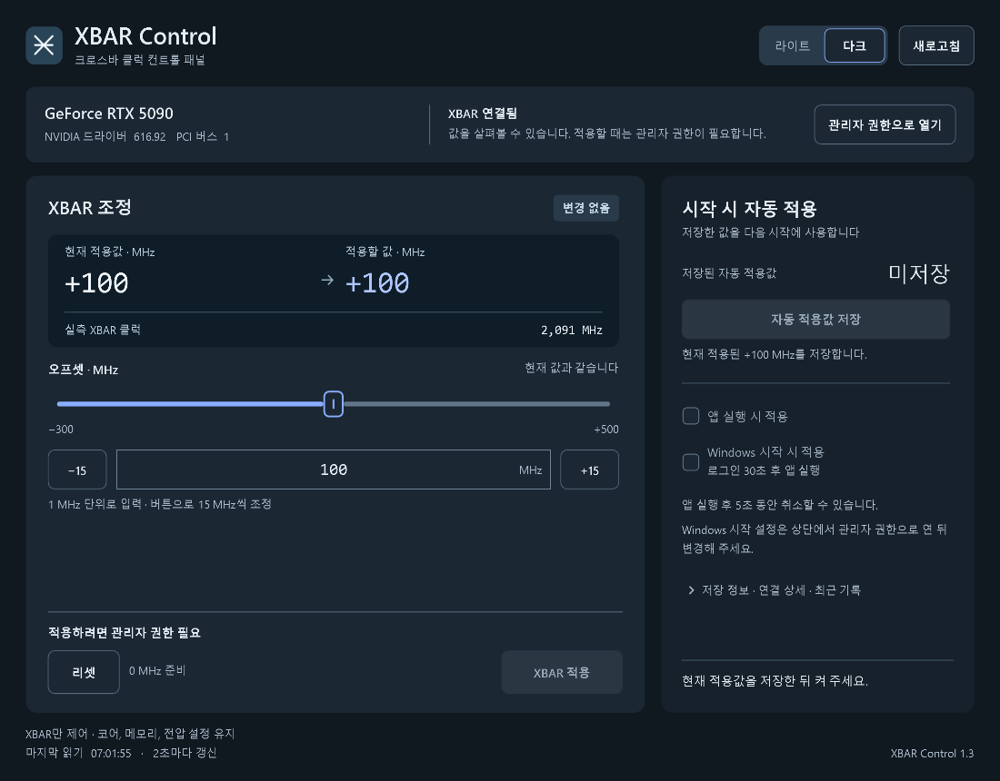
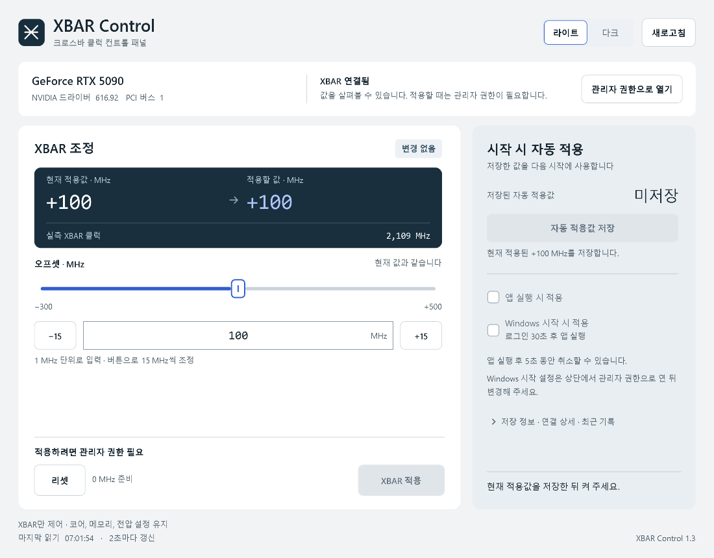

# XBAR Control

**XBAR 주파수 오프셋만 조정하는 Windows 데스크톱 앱.** 현재 적용값과 실측 클럭을 확인하고, 준비한 값을 직접 적용할 수 있습니다. 라이트·다크 모드를 지원합니다.

A small native Windows utility for XBAR frequency offsets, with a Korean interface and light/dark themes. Built with C# and WPF; no Python, browser, or original overclocking application is needed at runtime.

[**Windows 다운로드**](https://github.com/mkyoon80-alt/xbar-control/releases/tag/v1.3.0) · [한국어 사용법](docs/usage.ko.md) · [검증 범위](docs/validation.md)



<details>
<summary>라이트 모드 보기</summary>



</details>

## 주요 기능

- XBAR 오프셋과 실측 XBAR 클럭 표시, 여러 GPU 중 장치 선택.
- 직접 입력, 슬라이더, ±15 MHz 버튼으로 값을 준비한 뒤 **XBAR 적용**으로 반영.
- 라이트·다크 전환 및 선택 저장.
- 상단 GPU 상태, 왼쪽 수동 조정, 오른쪽 자동 적용으로 나눈 화면. 리셋·적용과 자동 적용 취소는 하단에 고정.
- 적용 직전 현재 값 확인, 적용 후 드라이버 응답 비교.
- 단일 **리셋** 버튼으로 오프셋 0 MHz 준비.
- **앱 실행 시 적용**과 **Windows 시작 시 적용**을 각각 선택. 현재 적용값을 별도로 저장해서 사용합니다.
- 코어·메모리·전압 조절, 종료 시 자동 복원 기능은 없습니다.

## 실행

Windows 10/11 64비트 및 .NET Framework 4.8을 대상으로 합니다. 릴리스의 `XbarControl-portable.zip`을 풀고 `XbarControl.exe`를 실행하세요. 값을 직접 적용하거나 Windows 시작 옵션을 변경하려면 앱의 **관리자 권한으로 열기**를 사용합니다.

자동 적용은 기본으로 꺼져 있습니다. **자동 적용값 저장** 후 원하는 시작 옵션을 켜세요. Windows 시작 옵션은 관리자 권한이 필요하며, 로그인 30초 후 실행됩니다. 두 모드 모두 5초 동안 취소할 수 있습니다. [설정·해제 방법](docs/usage.ko.md#시작-시-자동-적용-13)을 확인하세요.

기존 Windows 시작 옵션을 사용했다면 새 EXE를 관리자 권한으로 열고 해당 옵션을 껐다 켜세요. 저장값을 유지하면서 새 실행 파일과 30초 대기 시간으로 갱신합니다.

**실험적 도구입니다. RTX 5090 / NVIDIA 616.92에서 읽기와 화면 동작을 확인했지만, 실제 GPU 쓰기 및 오버클럭 안정성은 검증하지 않았습니다.** 입력 가능 범위는 안정성이 확인된 권장 범위가 아닙니다. 드라이버 검사에 실패하면 적용을 제한합니다. 자세한 지원 조건은 [검증 범위](docs/validation.md)를 참고하세요.

## 빌드

Windows PowerShell에서 저장소 폴더를 열고 실행합니다.

```powershell
.\build.ps1
```

Windows에 설치된 .NET Framework C# 컴파일러와 WPF 어셈블리를 사용합니다. 별도 패키지 복원 없이 `dist/XbarControl.exe`가 생성됩니다. XAML과 타사 라이선스는 실행 파일에 포함됩니다.

GPU API를 호출하지 않는 제어 데이터 테스트:

```powershell
$test = Start-Process .\dist\XbarControl.exe -ArgumentList '--self-test self-test.txt' -Wait -PassThru
Get-Content .\self-test.txt
if ($test.ExitCode -ne 0) { throw 'Self-test failed.' }
```

읽기 진단 및 UI 검증 명령은 [검증 문서](docs/validation.md)에 있습니다.

## 구현과 출처

NVAPI 인터페이스와 데이터 구조는 MIT 라이선스의 [SHANAjam/rtx5090-xbar-control](https://github.com/SHANAjam/rtx5090-xbar-control)을 참고했습니다. 고정된 XBAR 도메인과 마스크를 사용하며, 전압과 다른 도메인의 필드는 보존합니다. 비공개 드라이버 인터페이스에 의존하므로 드라이버 업데이트에 따라 지원 여부가 달라질 수 있습니다.

UI는 UI UX Pro Max와 Impeccable 지침을 적용한 네이티브 WPF 화면입니다. NVIDIA의 공식 제품이 아니며, NVIDIA 드라이버나 원본 오버클럭 프로그램은 배포물에 포함하지 않습니다.

MIT 라이선스. [LICENSE](LICENSE) 및 [THIRD-PARTY-NOTICES.txt](THIRD-PARTY-NOTICES.txt)를 확인하세요.
